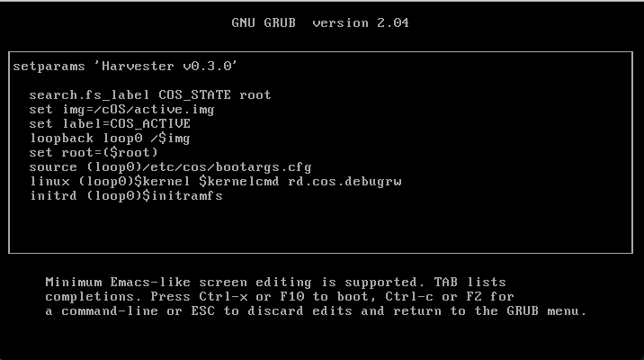

# Operating System

Harvester runs on a OpenSUSE-based OS. The OS is a derivative of [cOS toolkit](https://github.com/rancher-sandbox/cOS-toolkit).
We provide information and tips to help users troubleshoot OS-related issues in this guide.

## How to log in to a Harvester node?

Users can log in to a Harvester node with the username `rancher` and the password or SSH keypair that is provided during installation.
The user `rancher` can execute privileged commands without entering a password:

```
# Run a privileged command
rancher@node1:~> sudo blkid

# Or become root
rancher@node1:~> sudo -i
node1:~ # blkid
```


## How can I install packages? Why are some paths read-only?

The OS file system is image-based (just like a container image!) and immutable except for some directories. To temporarily enable the read-write mode, please following these steps:

!!! warning
    Enabling read-write mode might break your system if files are modified. Please use it at your own risk.

- Boot the system to GRUB menu. Press ESC to stay on the menu.
    

- Press `e` on first menuentry. Append `rd.cos.debugrw` to the `linux (loop0)$kernel $kernelcmd` line. Press `Ctrl + x` to boot the system.
    


## How to permanently edit kernel parameters

!!! note
    This is just a workaround. We should provide a better way to do this.

- Re-mount state directory in rw mode:
    ```
    # blkid -L COS_STATE
    /dev/vda2
    # mount -o remount,rw /dev/vda2 /run/initramfs/cos-state
    ```
- Edit the grub config file and append parameters to the `linux (loop0)$kernel $kernelcmd` line. The following example adds a `nomodeset` parameter:
    ```
    # vim /run/initramfs/cos-state/grub2/grub.cfg
    menuentry "Harvester ea6e7f5-dirty" --id cos {
      search.fs_label COS_STATE root
      set img=/cOS/active.img
      set label=COS_ACTIVE
      loopback loop0 /$img
      set root=($root)
      source (loop0)/etc/cos/bootargs.cfg
      linux (loop0)$kernel $kernelcmd nomodeset
      initrd (loop0)$initramfs
    }
    ```
- Reboot to take effect.

## How to change the default GRUB boot menu entry

To change the default entry, first, check the `--id` attribute of a menu entry. e.g.,

```
# cat /run/initramfs/cos-state/grub2/grub.cfg

<...>
menuentry "Harvester ea6e7f5-dirty (debug)" --id cos-debug {
  search.fs_label COS_STATE root
  set img=/cOS/active.img
  set label=COS_ACTIVE
  loopback loop0 /$img
```

The id of the above entry is `cos-debug`. We can then set the default entry by:

```
# grub2-editenv /oem/grubenv set saved_entry=cos-debug
```

## How to debug system crash or hang

### Collect crash log

If kernel panic traces are not recorded in the system log when a system crashes, one reliable way is to use a serial console.

To enable outputting kernel messages to a serial console, please following these steps:

- Boot the system to GRUB menu. Press ESC to stay on the menu.
    
- Press `e` on first menuentry. Append `console=ttyS0,115200n8` to the `linux (loop0)$kernel $kernelcmd` line. Press `Ctrl + x` to boot the system.

    

    !!! note
        Adjust the [console options](https://www.kernel.org/doc/html/latest/admin-guide/serial-console.html) according to your environment. **Make sure** append the `console=` string at the end of the line.
- Connect to the serial port to capture logs.

### Collect crash dumps
For kernel panic crashes, we can use kdump to collect crash dumps.

By default, the OS is booted without kdump feature enabled. Users can enable the feature by selecting the `debug` menuentry when booting. For example:


When a system crashes, a crash dump will be store in `/var/crash/<time>` directory. Providing the crash dump to developers helps troubleshooting issues.
